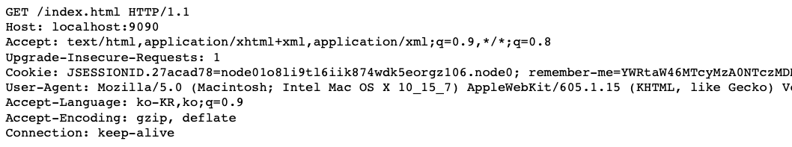

# 실습을 위한 개발 환경 세팅
* https://github.com/slipp/web-application-server 프로젝트를 자신의 계정으로 Fork한다. Github 우측 상단의 Fork 버튼을 클릭하면 자신의 계정으로 Fork된다.
* Fork한 프로젝트를 eclipse 또는 터미널에서 clone 한다.
* Fork한 프로젝트를 eclipse로 import한 후에 Maven 빌드 도구를 활용해 eclipse 프로젝트로 변환한다.(mvn eclipse:clean eclipse:eclipse)
* 빌드가 성공하면 반드시 refresh(fn + f5)를 실행해야 한다.

# 웹 서버 시작 및 테스트
* webserver.WebServer 는 사용자의 요청을 받아 RequestHandler에 작업을 위임하는 클래스이다.
* 사용자 요청에 대한 모든 처리는 RequestHandler 클래스의 run() 메서드가 담당한다.
* WebServer를 실행한 후 브라우저에서 http://localhost:8080으로 접속해 "Hello World" 메시지가 출력되는지 확인한다.

# 각 요구사항별 학습 내용 정리
* 구현 단계에서는 각 요구사항을 구현하는데 집중한다. 
* 구현을 완료한 후 구현 과정에서 새롭게 알게된 내용, 궁금한 내용을 기록한다.
* 각 요구사항을 구현하는 것이 중요한 것이 아니라 구현 과정을 통해 학습한 내용을 인식하는 것이 배움에 중요하다. 

### 요구사항 1 - http://localhost:8080/index.html로 접속시 응답
* kun-webservice.site:8080/index.html 접속시 응답 (OCI 환경)
* docker run -d -p 8080:8080 --name custom-web-server custom-web-server

- - -
* 소켓 / InputStream / OutputStream에 대한 이해
* 웹 요청 시 DataInputStream에 담기는 plain 데이터

* URL 추출하기
  * 요청 URL은 가장 첫번째 라인의 [1]번째에 위치. Util 클래스에 getUrlFromFirstLine 메소드 작성
* static 파일 별 헤더 셋업
  * .js/.css 등 다양한 resource 파일을 브라우저가 읽어들이기 위해서 형식(Content-type)을 지정 해야 함.
  * 마찬가지로 Util 클래스에 getContentType 메소드 작성하여 요청 별 header / body set-up 필요

### 요구사항 2 - get 방식으로 회원가입
* 도메인 / path / 쿼리스트링에 대한 이해

### 요구사항 3 - post 방식으로 회원가입
* http 패킷의 구조
* read 범위 지정 - 정확한 Content-length 만큼 읽어들이지 않으면 무한 루프에 빠진다.

### 요구사항 4 - redirect 방식으로 이동
* 302 응답 헤더의 형식 - ref) https://en.wikipedia.org/wiki/HTTP_302

### 요구사항 5 - cookie
* 상태 유지 방법
* 세션 / 쿠키

### 요구사항 6 - stylesheet 적용
* InputStream, OutputStream에 대한 이해
* Content-Type 헤더에 대한 이해

# 5장. 웹 서버 리팩토링. 서블릿 컨테이너와 서블릿의 관계

### 요구사항 1. 요청 데이터를 처리하는 로직을 별도의 클래스로 분리한다.(HttpRequest)

* HttpRequest 클래스가 생성되는 시점에 inputStream 바인딩.
* 이후 url, method, body, parameters 동적 생성
* 테스트코드를 통한 검증

### 요구사항 2. 응답 데이터를 처리하는 로직을 별도의 클래스로 분리한다.(HttpResponse)

* 
